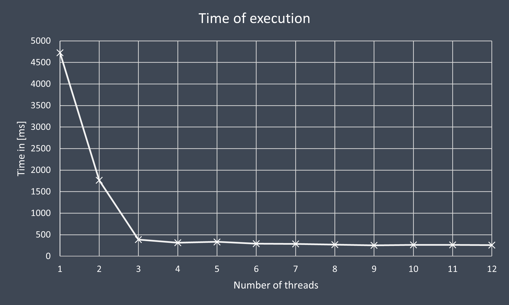

# WPF-CaesarCipher

A simple program that "encrypts" string with Caesar cipher.
It's a primitive encryption that uses char shift.
The point of this homework is to create an app that will apply this type of encryption on large text. And to avoid slowdown, the app must use multithreading.  

**The App UI is in Czech beause it's school homework.**

## What it can do?
- 'Unlimited' thread scalability
- Select number of threads for calculation
- Select char shift
- In code you can define your own alphabet (this cipher is **not** using char to ASCII code translation)

## What's missing?
- Text decryption
- Better input protection
- Inport/Export of text files
- Code optimization

## Speed test
The results should be taken with grain of salt. Test has not been conducted in laboratory controlled environment, so the result on same cpu can vary from run to run (because of background processes)  
- **Target framework:** .NET Core 3.1 (why not .NET 6.0? because school's computers are equipped with latest C# dev. tools from late 2019)
- **Used HW:** AMD Ryzen 1600
- **Windows version:** 21H2  
- Used [Text sample](/docs/sampleText.txt).
- Table [data source for graph](/docs/graph.xlsx).
### Graphs 

